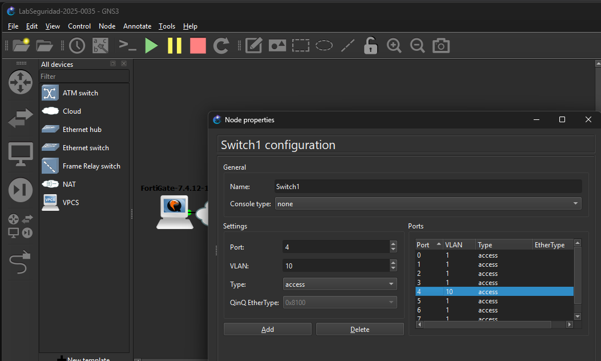

# Laboratorio de Seguridad de Redes — FortiGate
**Estudiante:** Gregorys Morel Duluc
**Matrícula:** 2025-0035

## Propósito del laboratorio
Este laboratorio implementa una arquitectura de seguridad perimetral basada en
FortiGate, diseñada para controlar el flujo de tráfico entre una red de usuarios,
un servidor web y un servidor de base de datos. Los objetivos de seguridad
incluyen: segmentación de red mediante VLANs, políticas de firewall con
NAT, inspección profunda de paquetes (DPI), prevención de intrusiones
(IPS) contra ataques de SQL Injection con cuarentena automática, control
de aplicaciones para bloquear descargas maliciosas, y mitigación de
ataques de denegación de servicio (DoS).

## Nota sobre el entorno de laboratorio
Durante el desarrollo del laboratorio, el equipo utilizado no logró
proporcionar soporte de virtualización anidada (KVM/HAXM) necesario para
ejecutar FortiGate-VM dentro de GNS3, a pesar de múltiples intentos de
configuración (VirtualBox con Nested VT-x/AMD-V habilitado, distintas
versiones de FortiOS, ajustes de red). La topología de red base (switch,
segmentación de VLANs, terminales) sí fue implementada y verificada en
GNS3. La configuración del FortiGate se documenta a continuación siguiendo
la guía oficial de administración de Fortinet, replicando exactamente los
pasos y parámetros que se aplicarían sobre el dispositivo activo.

Fuente oficial: https://docs.fortinet.com/document/fortigate/7.4.0/administration-guide/826586

## Diagrama de topología

## Direccionamiento IP (basado en matrícula 2025-0035)

| Segmento | Red | Máscara | Gateway |
|---|---|---|---|
| Servidores | 10.0.35.0/28 | /28 | 10.0.35.1 |
| WEB-Server | 10.0.35.2 | /28 | 10.0.35.1 |
| DB-Server | 10.0.35.3 | /28 | 10.0.35.1 |
| Usuarios (VLAN 10) | 10.0.35.128/25 | /25 | 10.0.35.129 |

## Topología implementada en GNS3

Switch con puertos configurados: VLAN 10 para segmento de usuarios,
puertos de acceso para servidores.

## Configuración de FortiGate (diseño documentado)

### 1. Ruta por defecto y NAT
- Destino: 0.0.0.0/0 → interfaz WAN (port2)
- NAT habilitado en las políticas de salida a Internet

### 2. Política 1 — Usuarios
